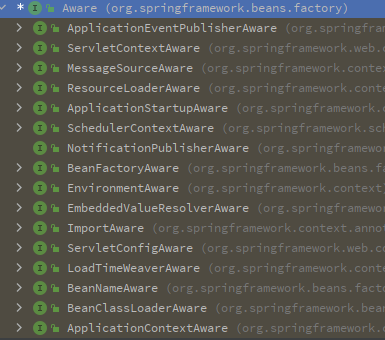
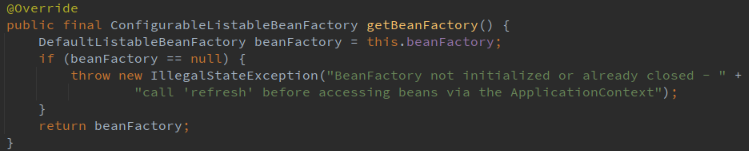

## Spring

### DefaultListableBeanFactory

Spring 的ConfigurableListableBeanFactory和BeanDefinitionRegistry接口的默认实现：一个基于 Bean 定义元数据的成熟 Bean 工厂，可通过后处理器进行扩展。BeanFactory的实现有很多，这个可以存放很多bean的一些元数据。


```java
private final Map<String, BeanDefinition> beanDefinitionMap = new ConcurrentHashMap<>(256);

/** Map from bean name to merged BeanDefinitionHolder. */
private final Map<String, BeanDefinitionHolder> mergedBeanDefinitionHolders = new ConcurrentHashMap<>(256);

/** Map of singleton and non-singleton bean names, keyed by dependency type. */
private final Map<Class<?>, String[]> allBeanNamesByType = new ConcurrentHashMap<>(64);

/** Map of singleton-only bean names, keyed by dependency type. */
private final Map<Class<?>, String[]> singletonBeanNamesByType = new ConcurrentHashMap<>(64);

/** List of bean definition names, in registration order. */
private volatile List<String> beanDefinitionNames = new ArrayList<>(256);
```

Spring启动流程的逻辑都是将不同配置的方式去解析成统一的对象，然后统一解析完成后，交给BeanFactory去创建对象。但是注解，XML等不同的方式，是通过策略模式将他们统一解析成**BeanDefinition**，里面存储的就是一个个对象的"设计图"，**DefaultListableBeanFactory**就是用来去存储这些BeanDefinition对象的，以Map方式进行存储，所以不管是ClassPathXmlApplicationContext（基于Xml方式的加载方式）还是基于AnnotationConfigApplicationContext（基于注解的方式）都会通过**组合**的方式去去组合DefaultListableBeanFactory ；

XML方式（ClassPathXmlApplicationContext）

```java
@Override
protected final void refreshBeanFactory() throws BeansException {
    if (hasBeanFactory()) {
        destroyBeans();
        closeBeanFactory();
    }
    try {
        // 创建档案馆
        DefaultListableBeanFactory beanFactory = createBeanFactory();
        beanFactory.setSerializationId(getId());
        customizeBeanFactory(beanFactory);
        // 加载beanDefinition信息，里面会获取配置文件位置，去解析Xml文件
        loadBeanDefinitions(beanFactory);
        this.beanFactory = beanFactory;
    }
    catch (IOException ex) {
        throw new ApplicationContextException("I/O error parsing bean definition source for " + getDisplayName(), ex);
    }
}
// xml方式是耦合在refresh()中12大步里面的obtainFreshBeanFactory()中不是很好，扩展性降低，注解的方式使用了扩展节点来解析，扩展性更强。
```

**loadBeanDefinitions(beanFactory);**里面无非是创建ResourceLoader资源加载器去循环解析xml文件里面的每一项，最后封装成BeanDefinitionHolder，最后会被**BeanDefinitionReaderUtils.registerBeanDefinition(bdHolder, getReaderContext().getRegistry());**注册到BeanDefinitionMap里面

```java
protected void processBeanDefinition(Element ele, BeanDefinitionParserDelegate delegate) {
    BeanDefinitionHolder bdHolder = delegate.parseBeanDefinitionElement(ele);
    if (bdHolder != null) {
        bdHolder = delegate.decorateBeanDefinitionIfRequired(ele, bdHolder);
        try {
            // Register the final decorated instance.
            BeanDefinitionReaderUtils.registerBeanDefinition(bdHolder, getReaderContext().getRegistry());
        }
        catch (BeanDefinitionStoreException ex) {
            getReaderContext().error("Failed to register bean definition with name '" +
                                     bdHolder.getBeanName() + "'", ele, ex);
        }
        // Send registration event. 发布一个通知事件
        getReaderContext().fireComponentRegistered(new BeanComponentDefinition(bdHolder));
    }
}
```

registerBeanDefinition方法会是DefaultListableBeanFactory里面的方法，会先进行校验BeanDefinition是否合法，并且检查BeanDefinitionMap中是否已经还有该BeanDefinition信息，如果没有的话就会被添加到BeanDefinitionMap中。而且还会将BeanDefinition中的别名一并注册；虽然操作的是BeanDefinitionRegistry，但最后信息都是会被put到DefaultListableBeanfactory中；

```java
public static void registerBeanDefinition(
    BeanDefinitionHolder definitionHolder, BeanDefinitionRegistry registry)
    throws BeanDefinitionStoreException {

    // Register bean definition under primary name.
    String beanName = definitionHolder.getBeanName();
    registry.registerBeanDefinition(beanName, definitionHolder.getBeanDefinition());

    // Register aliases for bean name, if any.
    String[] aliases = definitionHolder.getAliases();
    if (aliases != null) {
        for (String alias : aliases) {
            registry.registerAlias(beanName, alias);
        }
    }
}
```

### Aware接口以及调用逻辑

Spring给我们暴露了很多Aware接口，这些接口通常以Aware结尾，表示Bean能够感知某些特定的Spring容器功能。

```java
/**
 * @author tchstart
 * @data 2025-04-26
 */
@Component
public class Person implements ApplicationContextAware {

    ApplicationContext applicationContext;

    @Override
    public void setApplicationContext(ApplicationContext context) throws BeansException {
        // 利用回调机制，把ioc容器传入
        this.applicationContext = context;
    }
}
```



比如在组件中实现了**ApplicationContextAware**接口，就可以获取上下文对象；在组件中实现了**BeanFactoryAware**接口，就可以获取到BeanFactory信息。


**Aware的调用流程**

当我们将所有的配置解析成BeanDefinition之后，以为这就可以交给BeanFactory去创建对象。也就是refresh()中12大步中 **finishBeanFactoryInitialization(beanFactory);**来创建Bean，在创建Bean的过程中，会调用各种Aware接口，将需要的信息回调到Bean当中去。

```java
@Override
public void refresh() throws BeansException, IllegalStateException {
    // ...
    // Instantiate all remaining (non-lazy-init) singletons.
    finishBeanFactoryInitialization(beanFactory);
    // ...
}
```

按照正常的对象创建的流程可以找到doCreateBean方法中的

```java
// 属性赋值
populateBean(beanName, mbd, instanceWrapper);
// 初始化Bean，这一步里面会执行Aware接口的回调，进行功能的增强
exposedObject = initializeBean(beanName, exposedObject, mbd);
```

**initializeBean**的第一步就是调用**invokeAwareMethods(beanName,bean);**来对其中三个Aware接口进行回调，剩余的会通过**BeanProcessor**的扩展点方式进行回调；

**initializeBean**方法中会依次走到**applyBeanPostProcessorsBeforeInitialization**调用BeanProcessor接口的**postProcessBeforeInitialization**会调用**ApplicationContextAwareProcessor**里面会给Bean实例回调信息，前提是实现对应的Aware。

```java
@SuppressWarnings("deprecation")
protected Object initializeBean(String beanName, Object bean, @Nullable RootBeanDefinition mbd) {
    invokeAwareMethods(beanName, bean);

    Object wrappedBean = bean;
    if (mbd == null || !mbd.isSynthetic()) {
        wrappedBean = applyBeanPostProcessorsBeforeInitialization(wrappedBean, beanName);
    }

    try {
        invokeInitMethods(beanName, wrappedBean, mbd);
    }
    catch (Throwable ex) {
        throw new BeanCreationException(
            (mbd != null ? mbd.getResourceDescription() : null), beanName, ex.getMessage(), ex);
    }
    if (mbd == null || !mbd.isSynthetic()) {
        wrappedBean = applyBeanPostProcessorsAfterInitialization(wrappedBean, beanName);
    }

    return wrappedBean;
}

```

其中**BeanNameAware**，**BeanClassLoaderAware**，**BeanFactoryAware**三个接口时首先回调的。写死在代码中的，**initializeBean**的第一步。

```java
private void invokeAwareMethods(String beanName, Object bean) {
    if (bean instanceof Aware) {
        if (bean instanceof BeanNameAware beanNameAware) {
            beanNameAware.setBeanName(beanName);
        }
        if (bean instanceof BeanClassLoaderAware beanClassLoaderAware) {
            ClassLoader bcl = getBeanClassLoader();
            if (bcl != null) {
                beanClassLoaderAware.setBeanClassLoader(bcl);
            }
        }
        if (bean instanceof BeanFactoryAware beanFactoryAware) {
            beanFactoryAware.setBeanFactory(AbstractAutowireCapableBeanFactory.this);
        }
    }
}
```

下面这几个Aware接口是通过扩展点的方式**ApplicationContextAwareProcessor**进行回调

- EnvironmentAware
- EmbeddedValueResolverAware
- ResourceLoaderAware
- ApplicationEventPublisherAware
- MessageSourceAware
- ApplicationStartupAware
- ApplicationContextAware

```java
// ApplicationContextAwareProcessor  通过BeanProcessor扩展点的方式进行回调
@Override
@Nullable
public Object postProcessBeforeInitialization(Object bean, String beanName) throws BeansException {
    if (!(bean instanceof EnvironmentAware || bean instanceof EmbeddedValueResolverAware ||
          bean instanceof ResourceLoaderAware || bean instanceof ApplicationEventPublisherAware ||
          bean instanceof MessageSourceAware || bean instanceof ApplicationContextAware ||
          bean instanceof ApplicationStartupAware)) {
        return bean;
    }

    invokeAwareInterfaces(bean);
    return bean;
}

private void invokeAwareInterfaces(Object bean) {
    if (bean instanceof Aware) {
        // 如果这个bean是EnvironmentAware，则就给这个bean设置环境信息，下面的逻辑依旧
        if (bean instanceof EnvironmentAware environmentAware) {
            environmentAware.setEnvironment(this.applicationContext.getEnvironment());
        }
        if (bean instanceof EmbeddedValueResolverAware embeddedValueResolverAware) {
            embeddedValueResolverAware.setEmbeddedValueResolver(this.embeddedValueResolver);
        }
        if (bean instanceof ResourceLoaderAware resourceLoaderAware) {
            resourceLoaderAware.setResourceLoader(this.applicationContext);
        }
        if (bean instanceof ApplicationEventPublisherAware applicationEventPublisherAware) {
            applicationEventPublisherAware.setApplicationEventPublisher(this.applicationContext);
        }
        if (bean instanceof MessageSourceAware messageSourceAware) {
            messageSourceAware.setMessageSource(this.applicationContext);
        }
        if (bean instanceof ApplicationStartupAware applicationStartupAware) {
            applicationStartupAware.setApplicationStartup(this.applicationContext.getApplicationStartup());
        }
        if (bean instanceof ApplicationContextAware applicationContextAware) {
            applicationContextAware.setApplicationContext(this.applicationContext);
        }
    }
}

```

### populateBean (XML/注解)

在实例化对象中**finishBeanFactoryInitialization(beanFactory);**中里面会会对对象进行通过反射创建对象，实例化对象之后，此时对象只是创建了，但里面的值都还是为空，此时会调用**populateBean**进行属性赋值（XML、注解）两种方式都是在这个方法继续赋值。另外这个方法跟**refresh**方法一样。XML形式的属性赋值时耦合在方法中的，但是注解的方式也是通过**BeanPostProcessor**扩展点的方式进行属性赋值的。

```java
protected void populateBean(String beanName, RootBeanDefinition mbd, @Nullable BeanWrapper bw) {
    // ...

    // Give any InstantiationAwareBeanPostProcessors the opportunity to modify the
    // state of the bean before properties are set. This can be used, for example,
    // to support styles of field injection.
    if (!mbd.isSynthetic() && hasInstantiationAwareBeanPostProcessors()) {
        // 基于注解完成自动装配 AutowiredAnnotationBeanPostProcessor
        for (InstantiationAwareBeanPostProcessor bp : getBeanPostProcessorCache().instantiationAware) {
            if (!bp.postProcessAfterInstantiation(bw.getWrappedInstance(), beanName)) {
                return;
            }
        }
    }
	// ...
   
    if (pvs != null) {
   		// 通过xml方式进行属性赋值
        applyPropertyValues(beanName, mbd, bw, pvs);
    }
}
```


**AutowiredAnnotationBeanPostProcessor**是**InstantiationAwareBeanPostProcessor**的实现类，运行到此处会调用到**AutowiredAnnotationBeanPostProcessor**的**postProcessProperties**进行属性赋值完成基于注解的自动装配功能。通过**buildAutowiringMetadata**来解析属性或方法上是否含有@Autowired或者@Value注解，返回包装对象后，再通过**element.inject(target, beanName, pvs);**反射进行赋值。

```java
@Override
public PropertyValues postProcessProperties(PropertyValues pvs, Object bean, String beanName) {
    InjectionMetadata metadata = findAutowiringMetadata(beanName, bean.getClass(), pvs);
    try {
        metadata.inject(bean, beanName, pvs);
    }
    catch (BeanCreationException ex) {
        throw ex;
    }
    catch (Throwable ex) {
        throw new BeanCreationException(beanName, "Injection of autowired dependencies failed", ex);
    }
    return pvs;
}
```

### BeanFactoryPostProcessor

对BeanFactory进行后置增强。两个方法都是在**invokeBeanFactoryPostProcessors**中一起执行的

#### BeanDefinitionRegistryPostProcessor

>基于注解的方式，AnnotationConfigApplicationContext中会有这个实现类ConfigurationClassPostProcessor，这个方法会解析配置类@ComponentScan,@Bean..等注解，构建BeanDefition信息

对象没创建之前，refresh中12大步中的**invokeBeanFactoryPostProcessors(beanFactory);**会被调用，获取到所有的**BeanDefinitionRegistryPostProcessor**并创建对象，这个接口相对于普通的Bean会提前初始化。这个接口在**invokeBeanFactoryPostProcessors(beanFactory);**中调用的是按照顺序的@PriorityOrderd > @Ordered > 没有实现任何接口的，按照这个顺序依次调用。当所有顺序的**postProcessBeanDefinitionRegistry**接口都执行玩了之后，会在统一调用**BeanFactoryPostProcessor.postProcessBeanFactory()**方法的实现，也是按照@PriorityOrderd > @Ordered > 没有实现任何接口的顺序执行**postProcessBeanFactory**方法的

```java
public interface BeanDefinitionRegistryPostProcessor extends BeanFactoryPostProcessor {
    // invokeBeanFactoryPostProcessors(beanFactory);中执行，会优先普通对象创建对象
	void postProcessBeanDefinitionRegistry(BeanDefinitionRegistry registry) throws BeansException;
    
    // 当postProcessBeanDefinitionRegistry都执行完了之后，就会调用postProcessBeanFactory方法。
	@Override
	default void postProcessBeanFactory(ConfigurableListableBeanFactory beanFactory) throws BeansException {
	}
}
```

### BeanPostProcessor

对Bean进行后置增强（在于改变）

```java
public interface BeanPostProcessor {
    // initializeBean 中会被调用
    // 初始化之前的增强处理，改变之前创建的Bean实例
	@Nullable
	default Object postProcessBeforeInitialization(Object bean, String beanName) throws BeansException {
		return bean;
	}

     // initializeBean 中会被调用
	@Nullable
	default Object postProcessAfterInitialization(Object bean, String beanName) throws BeansException {
		return bean;
	}
}
```

**registerBeanPostProcessors(beanFactory);**会注册**BeanPostProcessor**，此时Bean没有被创建，如果想让Bean的后置处理器对Bean进行增强，BeanPostProcessor要优先被创建，就是在此出创建，放入到一个**List<BeanPostProcessor>**集合中，提前创建对象。

- **MergedBeanDefinitionPostProcessor**
- **SmartInstantiationAwareBeanPostProcessor**
- **InstantiationAwareBeanPostProcessor**
- ...

```java
// 注册Bean的后置处理器，也就是提前实例化
protected void registerBeanPostProcessors(ConfigurableListableBeanFactory beanFactory) {
    PostProcessorRegistrationDelegate.registerBeanPostProcessors(beanFactory, this);
}

public static void registerBeanPostProcessors(
    ConfigurableListableBeanFactory beanFactory, AbstractApplicationContext applicationContext) {

    // 获得容器中的所有的BeanPostProcessor
    String[] postProcessorNames = beanFactory.getBeanNamesForType(BeanPostProcessor.class, true, false);

    int beanProcessorTargetCount = beanFactory.getBeanPostProcessorCount() + 1 + postProcessorNames.length;
    beanFactory.addBeanPostProcessor(
        new BeanPostProcessorChecker(beanFactory, postProcessorNames, beanProcessorTargetCount));

    List<BeanPostProcessor> priorityOrderedPostProcessors = new ArrayList<>();
    List<BeanPostProcessor> internalPostProcessors = new ArrayList<>();
    List<String> orderedPostProcessorNames = new ArrayList<>();
    List<String> nonOrderedPostProcessorNames = new ArrayList<>();
    for (String ppName : postProcessorNames) {
        if (beanFactory.isTypeMatch(ppName, PriorityOrdered.class)) {
            BeanPostProcessor pp = beanFactory.getBean(ppName, BeanPostProcessor.class);
            priorityOrderedPostProcessors.add(pp);
            if (pp instanceof MergedBeanDefinitionPostProcessor) {
                internalPostProcessors.add(pp);
            }
        }
        else if (beanFactory.isTypeMatch(ppName, Ordered.class)) {
            orderedPostProcessorNames.add(ppName);
        }
        else {
            nonOrderedPostProcessorNames.add(ppName);
        }
    }

    // First, register the BeanPostProcessors that implement PriorityOrdered.
    sortPostProcessors(priorityOrderedPostProcessors, beanFactory);
    registerBeanPostProcessors(beanFactory, priorityOrderedPostProcessors);

    // Next, register the BeanPostProcessors that implement Ordered.
    List<BeanPostProcessor> orderedPostProcessors = new ArrayList<>(orderedPostProcessorNames.size());
    for (String ppName : orderedPostProcessorNames) {
        BeanPostProcessor pp = beanFactory.getBean(ppName, BeanPostProcessor.class);
        orderedPostProcessors.add(pp);
        if (pp instanceof MergedBeanDefinitionPostProcessor) {
            internalPostProcessors.add(pp);
        }
    }
    sortPostProcessors(orderedPostProcessors, beanFactory);
    registerBeanPostProcessors(beanFactory, orderedPostProcessors);

    // Now, register all regular BeanPostProcessors.
    List<BeanPostProcessor> nonOrderedPostProcessors = new ArrayList<>(nonOrderedPostProcessorNames.size());
    for (String ppName : nonOrderedPostProcessorNames) {
        BeanPostProcessor pp = beanFactory.getBean(ppName, BeanPostProcessor.class);
        nonOrderedPostProcessors.add(pp);
        if (pp instanceof MergedBeanDefinitionPostProcessor) {
            internalPostProcessors.add(pp);
        }
    }
    registerBeanPostProcessors(beanFactory, nonOrderedPostProcessors);

    // Finally, re-register all internal BeanPostProcessors.
    sortPostProcessors(internalPostProcessors, beanFactory);
    registerBeanPostProcessors(beanFactory, internalPostProcessors);

    // Re-register post-processor for detecting inner beans as ApplicationListeners,
    // moving it to the end of the processor chain (for picking up proxies etc).
    beanFactory.addBeanPostProcessor(new ApplicationListenerDetector(applicationContext));
}

```

#### SmartInstantiationAwareBeanPostProcessor

 预测Bean的类型，最后一次改变组件类型，在**registerListeners();**中会被调用

```java
public interface SmartInstantiationAwareBeanPostProcessor extends InstantiationAwareBeanPostProcessor {

	@Nullable
	default Class<?> predictBeanType(Class<?> beanClass, String beanName) throws BeansException {
		return null;
	}

	default Class<?> determineBeanType(Class<?> beanClass, String beanName) throws BeansException {
		return beanClass;
	}

    // doCreateBean -> createBeanInstance ->determineConstructorsFromBeanPostProcessors
    // 决定用哪个构造器，如果返回的值不为空，则按照构造器的内容去创建对象
	@Nullable
	default Constructor<?>[] determineCandidateConstructors(Class<?> beanClass, String beanName)
			throws BeansException {

		return null;
	}


	default Object getEarlyBeanReference(Object bean, String beanName) throws BeansException {
		return bean;
	}

}

```

**predictBeanType**

```java
protected void registerListeners() {
    //...

    // Do not initialize FactoryBeans here: We need to leave all regular beans
    // uninitialized to let post-processors apply to them!
    String[] listenerBeanNames = getBeanNamesForType(ApplicationListener.class, true, false);
   // ...
}

private String[] doGetBeanNamesForType(ResolvableType type, boolean includeNonSingletons, boolean allowEagerInit) {
		// ...
    // Check all bean definitions.
		for (String beanName : this.beanDefinitionNames) {
			// Only consider bean as eligible if the bean name is not defined as alias for some other bean.
			if (!isAlias(beanName)) {
				try {
					RootBeanDefinition mbd = getMergedLocalBeanDefinition(beanName);
					// Only check bean definition if it is complete.
					if (!mbd.isAbstract() && (allowEagerInit ||
							(mbd.hasBeanClass() || !mbd.isLazyInit() || isAllowEagerClassLoading()) &&
									!requiresEagerInitForType(mbd.getFactoryBeanName()))) {
						boolean isFactoryBean = isFactoryBean(beanName, mbd);
						BeanDefinitionHolder dbd = mbd.getDecoratedDefinition();
						boolean matchFound = false;
						boolean allowFactoryBeanInit = (allowEagerInit || containsSingleton(beanName));
						boolean isNonLazyDecorated = (dbd != null && !mbd.isLazyInit());
						if (!isFactoryBean) {
							if (includeNonSingletons || isSingleton(beanName, mbd, dbd)) {
								matchFound = isTypeMatch(beanName, type, allowFactoryBeanInit);
							}
						}
						else {
							if (includeNonSingletons || isNonLazyDecorated ||
									(allowFactoryBeanInit && isSingleton(beanName, mbd, dbd))) {
								matchFound = isTypeMatch(beanName, type, allowFactoryBeanInit);
							}
							if (!matchFound) {
								// In case of FactoryBean, try to match FactoryBean instance itself next.
								beanName = FACTORY_BEAN_PREFIX + beanName;
								if (includeNonSingletons || isSingleton(beanName, mbd, dbd)) {
									matchFound = isTypeMatch(beanName, type, allowFactoryBeanInit);
								}
							}
						}
						if (matchFound) {
							result.add(beanName);
						}
					}
				}
			}
		}
    	// ...
	}

protected boolean isTypeMatch(String name, ResolvableType typeToMatch, boolean allowFactoryBeanInit)
			throws NoSuchBeanDefinitionException {
		// ...
		// No singleton instance found -> check bean definition.
		BeanFactory parentBeanFactory = getParentBeanFactory();
		if (parentBeanFactory != null && !containsBeanDefinition(beanName)) {
            // 如果当前beanName没有被实例化，那么就会调用SmartInstantiationAwareBeanPostProcessor最后一次确定类型
			// No bean definition found in this factory -> delegate to parent.
			return parentBeanFactory.isTypeMatch(originalBeanName(name), typeToMatch);
		}
		// ...
	}
```

**registerListeners()**里面会实例化监听器，这时候会调用**getBeanNamesForType**根据类型获取**ApplicationListener**类型的信息，但在里面具体实现是遍历每一个beanName，判断beanName是否被实现，也就是查询这个bean是否被创建**getSingleton**，如果没创建就通过**isTypeMatch(beanName, type, allowFactoryBeanInit);**会调用Bean的后置处理器的predictBeanType来判断对象的类型。根据类型获取BeanNames里面会调用**SmartInstantiationAwareBeanPostProcessor**的后置处理器**predictBeanType**，将**beanDefinitionNames**遍历一边，调用**predictBeanType**最后一次确定Bean的类型。（此时beanDefinitionNames是所有的，包含BeanFactoryPostProcessor的对象，他们已经实例化了，虽然在beanDefinitionNames里面，但是不回在经过**predictBeanType**了，普通对象【还没有实例化的对象】会被次方法调用最后一次确定Bean的类型。

registerListeners()会注册监听器，但不会实例化这个普通的bean，后面在**finishBeanFactoryInitialization(beanFactory);**创建Bean实例的时候，还会调用这个bean的后置处理器的**predictBeanType**来确认普通对象的类型，所以这个bean的后置处理在两个地方都会触发。

#### InstantiationAwareBeanPostProcessor

```java
public interface InstantiationAwareBeanPostProcessor extends BeanPostProcessor {
	
    // createBean时候被调用，创建对象权交给自己
	@Nullable
	default Object postProcessBeforeInstantiation(Class<?> beanClass, String beanName) throws BeansException {
		return null;
	}

    // populateBean
    // 属性赋值之前，赋值权可自定义
    // @Autowired就是通过这个PostProcessor实现的，AntowiredAnnotationBeanPostProcessor，但没做啥事
	default boolean postProcessAfterInstantiation(Object bean, String beanName) throws BeansException {
        // 自己想注入的属性
		return true; // 返回false则bean的赋值全部结束
	}
	
    // populateBean
    // 属性赋值，@Autowired就是通过这个接口解析注解注入的
	@Nullable
	default PropertyValues postProcessProperties(PropertyValues pvs, Object bean, String beanName)
			throws BeansException {

		return pvs;
	}

}

```

**postProcessBeforeInstantiation**

在**finishBeanFactoryInitialization(beanFactory);**中创建对象createBean的会进行调用，如果bean实现了**InstantiationAwareBeanPostProcessor**接口，会在**resolveBeforeInstantiation**里面被调用后置处理器，将创建对象权力交给用户，如果我们自己创建了对象返回，Spring就不会在执行**doCreateBean(beanName,mbdToUse,args)**，代码如下：

```java
@Override
protected Object createBean(String beanName, RootBeanDefinition mbd, @Nullable Object[] args)
    throws BeanCreationException {
    // ...
    try {
        // Give BeanPostProcessors a chance to return a proxy instead of the target bean instance.
        Object bean = resolveBeforeInstantiation(beanName, mbdToUse);
        if (bean != null) {
            return bean;
        }
    }
    catch (Throwable ex) {
        throw new BeanCreationException(mbdToUse.getResourceDescription(), beanName,
                                        "BeanPostProcessor before instantiation of bean failed", ex);
    }

    try {
        Object beanInstance = doCreateBean(beanName, mbdToUse, args);
        if (logger.isTraceEnabled()) {
            logger.trace("Finished creating instance of bean '" + beanName + "'");
        }
        return beanInstance;
    }
    // ...
}
```


### InitializingBean

Bean组件初始化以后对组件进行后续设置（在于额外处理）因为他不回给你传入任何参数

```java
public interface InitializingBean {
    // initializeBean中执行，在BeanPostProcessor的两个方法中间执行
    // 可以在当前组件所有的属性全部就绪后，继续进行增强
	void afterPropertiesSet() throws Exception;
}
```

上面的**AutowiredAnnotationBeanPostProcessor**就是如此，注解版属性注入就是通过这个接口。

### Spring容器的启动流程-容器对象的基本创建

**new AnnotationConfigApplicationContext(MainConfig.class)**


#### this();

**this.reader = new AnnotatedBeanDefinitionReader(this)；**reader读取**beanDefinitionAnnotatedBeanDefinitionReader**后续就是为了加载底层功能组件的后置处理器；里面的**registerAnnotationConfigProcessors(registry, null)；registerAnnotationConfigProcessors**注册很多的处理器。给工厂中注册核心组件

```java
public static Set<BeanDefinitionHolder> registerAnnotationConfigProcessors(
			BeanDefinitionRegistry registry, @Nullable Object source) {

		DefaultListableBeanFactory beanFactory = unwrapDefaultListableBeanFactory(registry);
		if (beanFactory != null) {
			if (!(beanFactory.getDependencyComparator() instanceof AnnotationAwareOrderComparator)) {
				beanFactory.setDependencyComparator(AnnotationAwareOrderComparator.INSTANCE);
			}
			if (!(beanFactory.getAutowireCandidateResolver() instanceof ContextAnnotationAutowireCandidateResolver)) {
				beanFactory.setAutowireCandidateResolver(new ContextAnnotationAutowireCandidateResolver());
			}
		}

		Set<BeanDefinitionHolder> beanDefs = new LinkedHashSet<>(8);

		if (!registry.containsBeanDefinition(CONFIGURATION_ANNOTATION_PROCESSOR_BEAN_NAME)) {
			RootBeanDefinition def = new RootBeanDefinition(ConfigurationClassPostProcessor.class);
			def.setSource(source);
			beanDefs.add(registerPostProcessor(registry, def, CONFIGURATION_ANNOTATION_PROCESSOR_BEAN_NAME));
		}

		if (!registry.containsBeanDefinition(AUTOWIRED_ANNOTATION_PROCESSOR_BEAN_NAME)) {
			RootBeanDefinition def = new RootBeanDefinition(AutowiredAnnotationBeanPostProcessor.class);
			def.setSource(source);
			beanDefs.add(registerPostProcessor(registry, def, AUTOWIRED_ANNOTATION_PROCESSOR_BEAN_NAME));
		}

		// Check for JSR-250 support, and if present add the CommonAnnotationBeanPostProcessor.
		if (jsr250Present && !registry.containsBeanDefinition(COMMON_ANNOTATION_PROCESSOR_BEAN_NAME)) {
			RootBeanDefinition def = new RootBeanDefinition(CommonAnnotationBeanPostProcessor.class);
			def.setSource(source);
			beanDefs.add(registerPostProcessor(registry, def, COMMON_ANNOTATION_PROCESSOR_BEAN_NAME));
		}

		// Check for JPA support, and if present add the PersistenceAnnotationBeanPostProcessor.
		if (jpaPresent && !registry.containsBeanDefinition(PERSISTENCE_ANNOTATION_PROCESSOR_BEAN_NAME)) {
			RootBeanDefinition def = new RootBeanDefinition();
			try {
				def.setBeanClass(ClassUtils.forName(PERSISTENCE_ANNOTATION_PROCESSOR_CLASS_NAME,
						AnnotationConfigUtils.class.getClassLoader()));
			}
			catch (ClassNotFoundException ex) {
				throw new IllegalStateException(
						"Cannot load optional framework class: " + PERSISTENCE_ANNOTATION_PROCESSOR_CLASS_NAME, ex);
			}
			def.setSource(source);
			beanDefs.add(registerPostProcessor(registry, def, PERSISTENCE_ANNOTATION_PROCESSOR_BEAN_NAME));
		}

		if (!registry.containsBeanDefinition(EVENT_LISTENER_PROCESSOR_BEAN_NAME)) {
			RootBeanDefinition def = new RootBeanDefinition(EventListenerMethodProcessor.class);
			def.setSource(source);
			beanDefs.add(registerPostProcessor(registry, def, EVENT_LISTENER_PROCESSOR_BEAN_NAME));
		}

		if (!registry.containsBeanDefinition(EVENT_LISTENER_FACTORY_BEAN_NAME)) {
			RootBeanDefinition def = new RootBeanDefinition(DefaultEventListenerFactory.class);
			def.setSource(source);
			beanDefs.add(registerPostProcessor(registry, def, EVENT_LISTENER_FACTORY_BEAN_NAME));
		}

		return beanDefs;
	}
```

>ConfigurationClassPostProcessor.class(BeanFactoryPostProcessor) 处理配置类
>AutowiredAnnotationBeanPostProcessor.class(SmartInstantiationAwareBeanPostProcessor) 自动装配功能
>CommonAnnotationBeanPostProcessor.class(InstantiationAwareBeanPostProcessor)普通JSR250注解处理
>EventListenerMethodProcessor.class(BeanFactoryPostProcessor)事件功能
>DefaultEventListenerFactory.class 事件工厂

**this.scanner = new ClassPathBeanDefinitionScanner(this);** scanner扫描需要导入的所有的bean信息**ClassPathBeanDefinitionScanner**，准备环境变量等一些信息

#### register(componentClasses);

register(componentClasses);注册所有的主配置类，拿到主配置类的BeanDefinition创建出来的信息，AnnotationConfigUtils.processCommonDefinitionAnnotations(abd);完善主配置类的配置信息，把主配置类信息注册到beanDefinitionMap里面

### refresh()

#### prepareRefresh();

准备上下文环境


#### ConfigurableListableBeanFactory beanFactory = obtainFreshBeanFactory();

初始化Bean工厂 不同的工厂不同实现，里面含xml解析逻辑

**xml逻辑**



**注解逻辑，注解是在构造器的时候就创建了beanFactory，这时候直接返回**


#### prepareBeanFactory(beanFactory);

对工厂进行填充属性，给工厂里面设置好必要的工具；比如：el表达式解析器，资源解析器，基本的后置处理器、还注册了一些单实例Bean以下的东西都能自动注册进自己的组件中Environment、Properties

#### postProcessBeanFactory(beanFactory);

空实现，留个子类去实现该接口                                

#### invokeBeanFactoryPostProcessors(beanFactory);

调用我们的bean工厂的后置处理器，基于注解版会调用**ConfigurationClassPostProcessor**解析配置类的后置处理器在此工作，所有的功能的配置和开启都在配置类，如果有其他**BeanFactroyPostProcessor**会继续执行。**ConfigurationClassPostProcessor**没有执行前**singletonObjects**工厂很简单，只有前面步骤注册的简单组件和第一步注册的一些Bean定义信息


在执行**ConfigurationClassPostProcessor**的**ConfigurationClassPostProcessor**

- 拿到工厂中所有Bean定义信息
- 找到真正的配置类
- 使用**parser.parse(candidates);**进行配置类解析
- 解析@ComponentScan、@Component、@Import、@ImportResource...等注解，封装成BeanDefinition放入BeanDefinitionMap中


### 循环依赖

关键就是提前**暴露未完全创建完毕的Bean**，在Spring中主要使用了**三级缓存**来解决循环依赖：

- 一级缓存（Singleton Objects Map）：用于存储完全初始化完成的单例Bean。
- 二级缓存（Early Singleton Objects Map）：用于存储尚未完全初始化，但已实例化的Bean，用于提前暴露对象，避免循环依赖问题。
- 三级缓存（Singleton Factories Map）：用于存储对象工厂，当需要时，可以通过工厂创建早期Bean（特别是为了支持AOP代理对象的创建）。

解决步骤：首先Spring创建Bean实例，并将其加入三级缓存中（Factory）。当一个Bean依赖另一个未初始化Bean时，Spring会从三级缓存中获取Bean的工厂，并生成该Bean的对象（若有代理则是代理对象）代理对象存入二级缓存，解决循环依赖，一旦所有的Bean被完全初始化，Bean将转移到一级缓存中。

**解决循环依赖全流程**

1. 首先获取单例Bean的时候会通过BeanName先去singletonObjects（一级缓存）查找完整的Bean，如果找到则直接返回，否则进行步骤2。
2. 看对应的Bean是否在创建中，如果不在直接返回null，如果是则回去earlySingletonObjects（二级缓存）查找Bean，如果找到则返回，否则进行步骤3
3. 去singletonFactories（三级缓存）通过BeanName查找对应的工厂，如果存着工厂则通过工厂创建Bean，并且放到earlySingletonObjects中。
4. 如果三个缓存都没找到，则返回null

从上面步骤看出，如果查询发现Bean还未创建，到第二部就直接返回null，不回继续查二级和三级缓存。返回null之后，说明这个Bean还未创建，这个时候会标记这个Bean正在创建中，然后再调用createBean来创建Bean，而实际创建是调用方法doCreateBean。doCreateBean这个方法就会执行三个步骤：实例化、属性注入、初始化。**在实例化Bean之后，会往singletonFactories塞入一个工厂，而调用这个工厂的getObject发给发，就能得到这个Bean**

```java
addSingletonFactory(beanName,() -> getEarlyBeanReference(beanName,mbd,bean));
```

注意：此时Spring是不知道会不会有循环依赖发生的，但是它不管，反正往singletonFactories塞这个工厂，这里就是提前暴露。

然后就开始执行属性注入，这个时候A发现需要注入B，所以去getBean(B)，此时又会走一边上面描述的逻辑，到了B的属性注入这一步。

此时B调用getBean(A)，这时候一级缓存里面找不到，但是发现A正在创建中的，于是就从二级缓存中找，发现没找到，于是就从三级缓存中找，调用getObject就找到了。

并且通过上面提前暴露在三级缓存里暴露的工厂得到A，然后将这个工厂从三级缓存里伤处，并将A加入二级缓存中。

然后结果就是B属性注入成功。

紧接着B嗲用initializeBean初始化，追钟返回，此时B已经被加到了一级缓存。

这时候就回到A的属性注入，此时注入B，接着执行初始化，最后A也会被加入到一级缓存里，且从二级换中删除A。Spring解决循环依赖就是按照上面所述的逻辑来实现的。

重点就是在对象实例化之后，都会在三级缓存里加入一个工厂，提前对外暴露还未完整的Bean，这样如果被循环依赖了，对方就可以利用这个工厂得到一个不完整的Bean，破环了循环的条件。

### AOP

每一个功能的开启，要么写配置，要么注解。@EnableXXX开启XXX功能的注解。

```java
@Configuration
@EnableAspectJAutoProxy // 开启基于注解的AOP
public class AopOpenConfig {
}
```


**@EnableAspectJAutoProxy** 通过**@Import**导入了**AspectJAutoProxyRegistrar**


给容器中加入了**AspectJAutoProxyRegistrar**，实现了**ImportBeanDefinitionRegistrar**想BeanDefinitionRegistry注册一些东西，之后再refresh()中的invokeBeanFactoryPostProcessors(beanFactory);调用后置处理器，实例化Bean工厂的后置处理器，AspectJAutoProxyRegistrar就实例化了，从而会向registry也就是DefaultListableBeanFactory中加入BeanDefinition（就是向BeanDefinitionMap中添加BeanDefinition）**org.springframework.aop.config.internalAutoProxyCreator**


**AnnotationAwareAspectJAutoProxyCreator**


注册进来的是组件是一个BeanPostProcessor实现类，Bean的后置处理器，所以再Bean工厂增强的环节不回运行，但是再Bean组件创建环节（getBean）会干预到，也就是对组件进行功能增强。目前只是加载了BeanDefinitionMap中，还没有被实例化。

BeanPostProcessor统一实例化的步骤在registerBeanPostProcessors(beanFactory);而且它实现了**Ordered**接口，会首先会被创建，正常的走getBean() => doGetBean() => createBean() => doCreateBean()来创建AnnotationAwareAspectJAutoProxyCreator对象。

在initializeBean，初始化的时候，因为实现了BeanFactoryAware接口，会在这时候调用该回调，从而调用它本身的setBeanFactory()方法


AnnotationAwareAspectJAutoProxyCreator对象在初始化期间initializeBean准备好了其需要的基本信息

```java
protected void initBeanFactory(ConfigurableListableBeanFactory beanFactory) {
    // 给AnnotationAwareAspectJAutoProxyCreator对象里面的值进行赋值
    this.advisorRetrievalHelper = new BeanFactoryAdvisorRetrievalHelperAdapter(beanFactory);
}
```

>继承Order接口，是想让它在registerProcessor中第一个被创建对象，然后在后面每一次创建对象的时候都会生效，进行增强，不仅后面单实例bean创建时候会被调用，而且如果registerProcessor中还有自定义的PostProcessor待创建也会被调用。
>
>因为该接口还是实现了InstantiationAwareBeanPostProcessor接口，这个接口在createBean中的doCreateBean之前会被干预到

```java
@Override
	public Object postProcessBeforeInstantiation(Class<?> beanClass, String beanName) {
		Object cacheKey = getCacheKey(beanClass, beanName);

		if (!StringUtils.hasLength(beanName) || !this.targetSourcedBeans.contains(beanName)) {
			// advisedBean不需要增强
			if (this.advisedBeans.containsKey(cacheKey)) {
				return null;
			}
			// 是不是基础的bean 是不是需要跳过的 重复判断
			if (isInfrastructureClass(beanClass) || shouldSkip(beanClass, beanName)) {
				this.advisedBeans.put(cacheKey, Boolean.FALSE);
				return null;
			}
		}

		TargetSource targetSource = getCustomTargetSource(beanClass, beanName);
		if (targetSource != null) {
			if (StringUtils.hasLength(beanName)) {
				this.targetSourcedBeans.add(beanName);
			}
			Object[] specificInterceptors = getAdvicesAndAdvisorsForBean(beanClass, beanName, targetSource);
			Object proxy = createProxy(beanClass, beanName, specificInterceptors, targetSource);
			this.proxyTypes.put(cacheKey, proxy.getClass());
			return proxy;
		}

		return null;
	}
```

因为实现了BeanPostProcessor，所以在对象创建之前和之后都会被干涉，**shouldSkip(beanClass, beanName)**其中第一次干涉的时候会获取增强器和切面，放入缓存，避免后续重复遍历获取增强器和切面。

